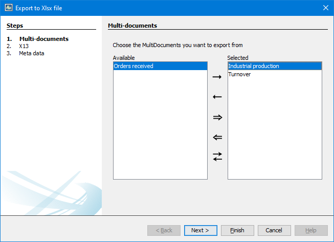

To start exporting go to File -> Export to Xlsx file .

After opening the export wizard there are two options to choose from:

1. Pressing "Finish" to export all information of the selected MultiDocuments
2. Go through the whole wizard to select the information you want to export.

WARNING: The information "saitem" will be taken from the item and if no name is specified an ascending number will be used as name.